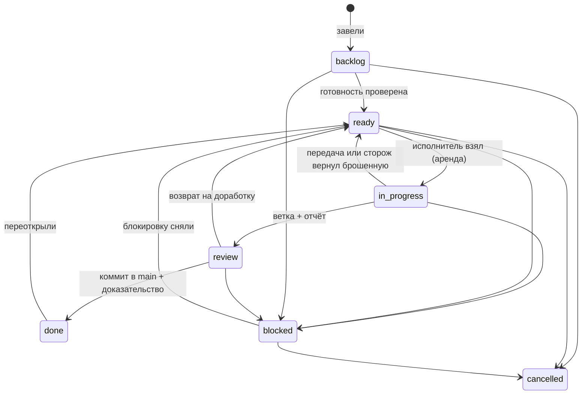

# Система разработки iHelp

Версия 1 от 24.09.2026, задача DEV-13. Документ меняется вместе с кодом, который эти правила проверяет: `src/lib/cc-flow.ts`, `src/server/services/ccWork.ts`, `scripts/cc.mjs` и хуки в `.claude/`. Если правило здесь расходится с кодом, верить надо коду. Расхождение — повод для задачи.

**Зачем система.** Продукт должен строиться правильно с первого раза. Задача входит в работу понятной и выходит из неё с доказательством. Несколько чатов работают параллельно и не мешают друг другу. Ничего не теряется и не висит без внимания.

Прототип — Command Center проекта LIA. Оттуда взяты: доска как единственный источник правды; роли с чёткими границами; аренда задачи с пульсом; сторож для брошенных задач; «Готово» только с доказательством; эпик закрывается только после всех своих задач; возврат на доработку с причиной; карточка, где по клику видно всё. Не взяты, по решению владельца от 23.09.2026: журнал задач в `.git`, хуки, которые блокируют правки, и агенты, которые сами мёрджат и выкладывают.

---

## 1. Восемь правил

1. **Control Center — единственный источник правды.** Нет карточки — нет работы. Любая работа начинается с карточки и заканчивается отчётом в ней. Ветку без карточки деплоер не рассматривает.
2. **В работу попадает только готовое.** Готово — значит, у задачи есть «зачем», проверяемые критерии приёмки, решения владельца и дизайн, если это интерфейс. Недосказанное в работу не идёт: по нему нужен вопрос продукту или владельцу, а не догадка разработчика. Это главная защита от переделок.
3. **«Готово» — только с доказательством.** Для код-задачи это коммит в `main` и описание, что проверено после выкладки. «Собралось» и «тесты зелёные» — ещё не «готово».
4. **Кто пишет код, тот не выкладывает. Кто выкладывает, тот не пишет.** Разработчик сдаёт ветку. Деплоер проверяет и выкладывает. Закрывает задачу деплоер или владелец.
5. **Одна задача, один исполнитель, одна ветка, одна рабочая копия.** Основную копию `/opt/ihelp.am` не переключает никто, кроме деплоера.
6. **Живой пульс.** Исполнитель держит задачу по аренде, и пульс продлевает её автоматически. Если исполнитель замолчал, сторож это видит, сообщает и возвращает задачу в очередь. Работа при этом не теряется: ветка остаётся.
7. **Всё записано.** Отчёты, ошибки, передачи и вопросы хранятся в ленте задачи. Решения владельца — в [DECISIONS.md](DECISIONS.md), сквозные алгоритмы — в [specs/](specs/README.md). Чат можно закрыть в любой момент, и следующий продолжит по карточке.
8. **Важное правило проверяет код, а не память чата.** Гейты стоят в сервисе, сторож работает в cron, пульс идёт из хука. Если проверка сама сломалась, она не блокирует работу и ничего не удаляет.

---

## 2. Роли

| Роль | Кто | Главное | Инструкция |
|---|---|---|---|
| Владелец | человек | решает, что и зачем: приоритеты, деньги, внешние аккаунты и ключи, внешний вид новых экранов | [roles/OWNER.md](roles/OWNER.md) |
| Техдиректор (CTO) | один чат Claude, постоянно | держит доску в порядке: готовность задач, архитектура, разбиение, зависимости, раздача работы, «Нужно вам», сама система разработки | [roles/CTO.md](roles/CTO.md) |
| Продакт | чат Claude по требованию или владелец | требования и критерии приёмки, тексты, приёмка продуктовых задач | [roles/PRODUCT.md](roles/PRODUCT.md) |
| Дизайнер | чат Claude по требованию | макеты и требования к интерфейсу до разработки, приёмка внешнего вида | [roles/DESIGNER.md](roles/DESIGNER.md) |
| Разработчик | чаты или воркеры Claude, от одного до нескольких параллельно | одна задача за раз: код, тесты, ветка, отчёт | [roles/DEVELOPER.md](roles/DEVELOPER.md) |
| Тестировщик | воркер или чат Claude | проверка сданного: тесты, критерии, стенд, скриншоты — «протестировано» на коммит или возврат | [roles/TESTER.md](roles/TESTER.md) |
| Деплоер | один: воркер или чат Claude | проверка протестированного, выкладка через `scripts/deploy-task.sh`, закрытие с доказательством, возврат на доработку | [DEPLOYER_GUIDE.md](DEPLOYER_GUIDE.md) |
| Сторож | автомат, каждые 15 минут | брошенные задачи, возврат в очередь, снятие блокировок по зависимостям, напоминания | раздел 6 ниже |

Первые сообщения для каждого чата — в [roles/KICKOFF.md](roles/KICKOFF.md). Разработчиков, тестировщика и деплоера можно не запускать руками: их по очереди задач запускает диспетчер — [WORKERS.md](WORKERS.md).

**Брифинг.** Взяв задачу (`take`, `next`, `test`), чат или воркер получает брифинг: роль по типу задачи (код — разработчик, без кода — продуктовая работа, проверка — тестировщик), правила этой роли, карточку задачи и точные команды, чтобы довести её до конца. Посмотреть брифинг в любой момент — `node scripts/cc.mjs brief КЛЮЧ`.

**Имя агента** — это роль и номер: `cto`, `product`, `designer`, `deployer`, `dev-1`, `dev-2`… По префиксу имени система определяет права. Незнакомое имя получает права разработчика, то есть самые узкие.

### Кто что делает

| Действие | Владелец | CTO | Продакт | Дизайнер | Разработчик | Деплоер | Сторож |
|---|---|---|---|---|---|---|---|
| Завести задачу | ✅ | ✅ | ✅ | — | предлагает в ленте | — | — |
| Проверить готовность, перевести в «Готова к работе» | ✅ | ✅ | ✅ | — | — | — | — |
| Решения о деньгах, продукте, внешних аккаунтах | ✅ | предлагает | предлагает | — | — | — | — |
| Макет и требования к интерфейсу | согласует | — | согласует | ✅ | — | — | — |
| Взять задачу в работу | — | при необходимости | — | — | ✅ | нельзя | — |
| Код, тесты, ветка, отчёт | — | при необходимости | — | — | ✅ | — | — |
| Проверить, выложить, закрыть «Готово» | ✅ | — | принимает продуктовые | принимает вид | — | ✅ | — |
| Вернуть на доработку | ✅ | ✅ | ✅ | — | — | ✅ | — |
| Вернуть брошенную задачу в очередь | ✅ | ✅ | — | — | — | — | ✅ |
| Изменить систему разработки | утверждает | ✅ | — | — | — | — | — |

---

## 3. Жизненный цикл задачи



| Статус | Что значит | Кто переводит | Условие |
|---|---|---|---|
| **Бэклог** | идея или потребность, к работе ещё не готова | любой, кто завёл задачу | — |
| **Готова к работе** | чек-лист готовности пройден, задача ждёт исполнителя | CTO, продакт, владелец | обязательные пункты готовности (раздел 4) |
| **В работе** | задачу держит исполнитель с живой арендой | только сам исполнитель командой `take` или `next` | задача в статусе «Готова к работе», зависимости закрыты, исполнитель свободен, её файлы не меняет другая задача в работе |
| **На проверке** | ветка отправлена, отчёт написан; очередь деплоера | исполнитель | у код-задачи — ветка, у любой — отчёт от 40 символов |
| **Готово** | влито в `main`, выложено, проверено | деплоер или владелец | у код-задачи — коммит в `main` и что проверено; у прочих — доказательство словами или файлом |
| **Заблокирована** | ждёт кого-то или чего-то | любой | причина и кто разблокирует: владелец, продукт, дизайн, техника, внешний сервис, зависимости |
| **Отменена** | делать не будем | CTO, продакт, владелец | причина |

Причину словами нужно написать при возврате на доработку, передаче, блокировке, отмене, переоткрытии и возврате из «Готова» в бэклог.

Обойти гейт могут только владелец и CTO, и всегда с причиной. В истории это отмечается строкой «Проверка обойдена».

Эпик получает статус «Готово», только когда все его задачи закрыты: либо «Готово», либо «Отменена».

**Метки здоровья.** Это не статусы, их видно в списке, на доске и в карточке:

- 🪦 **брошена?** — аренда истекла, пульса нет;
- 👻 **без исполнителя** — статус «В работе», но задачу никто не держит;
- ⏳ **проверка затянулась** — задача на проверке дольше суток;
- ✋ **ждёт владельца** — заблокирована на владельце или продукте;
- 🔒 **ждёт зависимостей** — есть незакрытые зависимости;
- ↩ **возвращалась ×N** — сколько раз задачу возвращали с проверки;
- **бросали ×N** — сколько раз исполнитель бросал задачу;
- ⚠ **ошибки: N** — сколько ошибок записано в ленте.

---

## 4. Карточка задачи и готовность к работе

| Поле | Зачем | Нужно для «Готова к работе» |
|---|---|---|
| Ключ | `AREA-N`, например `AUTH-12`. Не меняется: по нему связаны зависимости, история, ветка `task/AUTH-12` и коммиты `AUTH-12: …` | да |
| Заголовок | что получится, одной фразой | да |
| Суть | зачем: какая проблема и для кого, от 20 символов | **обязательно** |
| Критерии приёмки | проверяемые утверждения, по которым задача считается сделанной | **обязательно** хотя бы один, желательно от двух |
| Подробности | контекст, ограничения, что уже сделано | — |
| Дизайн | для интерфейса — текст или приложенный макет | предупреждение, если интерфейс без дизайна |
| Нужно от продукта | вопросы и решения, без которых нельзя начать | предупреждение, пока список не пуст |
| Зависит от | ключи задач, которые должны быть закрыты раньше | задачу с открытыми зависимостями взять нельзя |
| Затрагивает файлы | пути, которые задача будет менять | предупреждение; по ним параллельные исполнители не сталкиваются |
| Оценка | S, M или L | предупреждение; L лучше разбить на эпик и задачи |
| Эпик, этап, приоритет, область, слой, кто делает | место задачи в продукте и плане | да |
| Проверка и тестирование, готовность к деплою | как проверить; миграции, флаги, порядок выкладки | заполняет разработчик по ходу |

Чек-лист готовности виден в карточке задачи. Жёсткие пункты («зачем» и хотя бы один критерий) не пускают задачу в «Готова к работе». Остальные пункты — предупреждения: CTO смотрит их прежде, чем отдать задачу разработчику.

**Как завести задачу:**

- в интерфейсе: Control Center → «Новая задача»;
- из чата CTO или продакта: `node scripts/cc.mjs create --file задача.json --agent cto`;
- плановый бэклог — в коде, в файле `src/server/backlog.ts`; он заливается при выкладке, тексты можно дорабатывать в админке. Статус из кода учитывается только при первом появлении задачи и только два: `done` (уже работает) и `review` (задача заведена в той же ветке, что и её код, и сразу приходит на проверку).

```json
{
  "key": "NOTIFY-9",
  "title": "Напоминание клиенту за день до визита",
  "summary": "Клиенты забывают о визите, мастер приезжает зря. Напоминание за день снижает неявки.",
  "requirements": ["Клиент получает напоминание за 24 часа до визита", "Отменённый или перенесённый визит напоминания не получает"],
  "design": "Текст напоминания — в messages/ru.json, согласован продуктом",
  "needs": [],
  "depends": ["NOTIFY-6"],
  "docs": ["docs/specs/notifications.md"],
  "epicKey": "notify",
  "area": "notify", "layer": "back", "priority": "p1", "stage": "public", "owner": "tech", "estimate": "S",
  "scope": ["src/server/services/reminders.ts", "src/app/api/cron/route.ts"]
}
```

Задача размера L — это эпик: её разбивают на задачи S или M, у каждой свой проверяемый результат.

---

## 5. Работа над задачей

Подробно — в [roles/DEVELOPER.md](roles/DEVELOPER.md). Коротко:

```bash
node scripts/cc.mjs next --agent dev            # взять следующую готовую (имя dev-N выдаётся само)
node scripts/cc.mjs take AUTH-12 --agent dev-2  # или конкретную
# → рабочая копия /opt/ihelp.am/.claude/worktrees/AUTH-12 на ветке task/AUTH-12
#   (перейти в неё: инструмент EnterWorktree с этим путём)
# код → проверка типов и тестов → коммиты «AUTH-12: …» → git push -u origin task/AUTH-12
node scripts/cc.mjs note AUTH-12 "Сделал схему, дальше сервис"          # ход работы
node scripts/cc.mjs note AUTH-12 "vitest падает на slots.test.ts" --error
node scripts/cc.mjs review AUTH-12 "Сделано: … Проверено: … Проверить: … Риски: …"
```

`review` сам проверяет, что ветка отправлена и в ней нет неотправленных коммитов. К отчёту он добавляет факты из git: коммиты, объём изменений, отставание от `main` и миграции базы.

---

## 6. Аренда, пульс и сторож

- **Аренда.** Взятая задача держится 60 минут. Каждый признак жизни продлевает её ещё на 60 минут.
- **Пульс.** Хук Claude Code (`.claude/hooks/cc-pulse.sh`, событие PostToolUse) срабатывает, пока чат работает над задачей, но не чаще раза в 5 минут. Задачу хук узнаёт по ветке рабочей копии, а если чат работает из другой папки — по тому, какую задачу этот чат взял командой `take` или `next`. Команды `note` и `pulse` тоже продлевают аренду. После `review`, `handoff` или `block` пульс по задаче прекращается. Если задачу у чата забрали — сторож вернул её в очередь или её перехватил другой исполнитель, — хук один раз говорит ему остановиться.
- **Сторож** запускается каждые 15 минут из `/api/cron`. Он:
  - через 60 минут без пульса ставит метку «брошена?», пишет об этом в ленту и сообщает в тех-чат Telegram;
  - через 4 часа после метки возвращает задачу туда, откуда её взяли — обычно в «Готова к работе». Ветка сохраняется, счётчик «бросали» растёт, в ленту попадает последняя запись исполнителя;
  - если чат ожил и снова подал пульс, снимает метку сам;
  - про «В работе» без исполнителя сообщает, но решение оставляет человеку;
  - снимает блокировку «зависимости», когда зависимости закрылись;
  - раз в сутки напоминает о задачах, которые ждут проверки дольше суток.
- **Ждёте ответа владельца дольше нескольких минут?** Выполните `node scripts/cc.mjs block КЛЮЧ "вопрос" --on owner`. Тогда задача появится у владельца в «Нужно вам», а не станет «брошенной».
- **Продолжить брошенную задачу** можно после того, как её аренда истекла: `take КЛЮЧ` перехватывает её, продолжать нужно с сохранённой ветки. Владелец может вернуть задачу в очередь кнопкой в панели «Нужно вам».

Сроки заданы в `src/lib/cc-flow.ts`: `LEASE_MIN`, `RETURN_AFTER_STALE_MIN`, `REVIEW_STUCK_HOURS`.

---

## 7. Параллельная работа

1. Одна задача — один исполнитель; один исполнитель — одна задача. Это проверяет база: у одного имени заявки на задачи выполняются строго по очереди.
2. Каждая задача ведётся в своей рабочей копии `.claude/worktrees/<КЛЮЧ>` на ветке `task/<КЛЮЧ>`. Основную копию `/opt/ihelp.am` не переключать: из неё работает деплоер и выкладывается прод.
3. `next` не выдаёт задачу, которая по полю «Затрагивает файлы» пересекается с задачей, уже взятой в работу. `take` с такой задачей отказывает с ошибкой `scope_conflict`. Если по ходу работы пришлось трогать чужую область, запишите это в ленту и предупредите CTO.
4. Стенды. Порт 8080 — прод. 8081 — стенд деплоера. 8082–8099 — стенды разработчиков, перед запуском проверьте, что порт свободен: `ss -ltn`. **`docker compose` без `COMPOSE_PROJECT_NAME` работает с продом**: в `docker-compose.yml` зашито имя проекта `homecare`. Стенд поднимается только так, как описано в [DEPLOYER_GUIDE.md](DEPLOYER_GUIDE.md), шаг 5, и сносится после проверки.
5. Чатам лучше давать названия с ключом задачи, например «AUTH-12 · dev-2». Так в списке чатов сразу видно, кто что держит.
6. Разумная параллельность для этого сервера — 2–3 разработчика одновременно. Сборки тяжёлые, а на сервере живут соседние проекты.

---

## 8. Проверка, выкладка и доказательство

Подробно — в [DEPLOYER_GUIDE.md](DEPLOYER_GUIDE.md). Коротко:

- Статус «На проверке» — это две очереди подряд. Сначала **тестировщик** (`test` → `pass` или `fail`) ставит отметку «протестировано» на конкретный коммит ветки или возвращает задачу. Потом **деплоер** выкладывает только протестированный коммит. Новый коммит в ветке после проверки требует новой проверки.
- Не годится → `node scripts/cc.mjs return КЛЮЧ "что исправить" --agent deployer` (тестировщик — `fail`). Задача уходит в «Готова к работе» с меткой «возвращалась», следующий исполнитель берёт её первой и продолжает с той же ветки.
- Годится → `scripts/deploy-task.sh КЛЮЧ`, единственный путь в прод и для воркера, и для чата. Скрипт делает слияние, бэкап перед миграцией, `deploy/update.sh` и smoke-тест. При провале он откатывает прод и возвращает задачу, при успехе закрывает её «Готово» с коммитом и доказательством.
- Продуктовую задачу с видимым пользователю результатом стоит показать владельцу или продакту до закрытия.
- Уборка рабочих копий закрытых задач: `node scripts/cc.mjs gc`. Команда убирает только чистые копии с уже влитыми ветками.

---

## 9. Ошибки

- Ошибка по ходу задачи: упал тест, не собирается, стенд не поднимается — `note КЛЮЧ "…" --error`. В ленте она выделена красным, в карточке растёт счётчик ошибок.
- Упала выкладка — деплоер записывает ошибку в задачу, при необходимости делает откат (`deploy/rollback.sh`) и возвращает задачу с причиной.
- Ошибки работающего сайта приходят тех-алертами в Telegram. Журнал ошибок в Control Center — задача DEV-14.
- Ошибка повторилась — её надо превратить в проверку: тест, гейт или правило сторожа — и дописать в раздел 12. Заметка в памяти чата повторения не предотвращает.

---

## 10. Где что хранится

| Что | Где | Резервная копия |
|---|---|---|
| Задачи, эпики, статусы, лента, история | база Control Center | ночной бэкап базы с проверкой восстановления |
| Тексты планового бэклога и эпиков | `src/server/backlog.ts`, `src/server/epics.ts` | git и GitHub |
| Файлы к задачам и эпикам | том `uploads` | ночной бэкап вместе с базой |
| Код | ветки `task/<КЛЮЧ>`, `main` | GitHub |
| Правила и роли | этот документ, [roles/](roles/README.md), `CLAUDE.md` | git |
| Решения владельца | [DECISIONS.md](DECISIONS.md) | git |
| Сквозные алгоритмы и техстек | [specs/](specs/README.md), эпики | git |
| Передача между чатами | лента задачи (`handoff`); у CTO ещё и память проекта Claude | база, память |
| Логи приложения | `docker compose logs app` | не хранятся долго |

---

## 11. Когда нужен владелец

Без решения владельца не делается:

- деньги: цены, скидки, тарифы, способы оплаты;
- внешние аккаунты, ключи и платные сервисы;
- новый экран или заметная смена вида — нужно утверждение макета;
- удаление данных и миграции, которые что-то удаляют;
- права и роли сотрудников;
- юридические тексты и обработка персональных данных;
- выкладка в обход деплоера;
- изменение этой системы.

Как спрашивать: коротко, с вариантами, с плюсами и минусами каждого и со своей рекомендацией. Если ответ нужен, чтобы продолжить задачу, её блокируют (`--on owner`), и вопрос появляется у владельца в «Нужно вам».

---

## 12. Чего мы больше не делаем

Каждая строка ниже — реальный случай. После каждого добавлена проверка.

| Было | Чем кончилось | Что проверяет теперь |
|---|---|---|
| Статус «В работе» ставился из кода бэклога | 13 задач числились «в работе», хотя никто над ними не работал | из кода задача получает только «Готово» или «На проверке» (если заведена в той же ветке, что и её код); «В работе» даёт только аренда; сторож сообщает о задачах «без исполнителя» |
| Вызов `claim` взял «следующую» задачу вместо нужной (NOTIFY-1) | чужая задача повисла в работе | `take КЛЮЧ` берёт конкретную задачу |
| Задачу бросили в работе (OTP-1, аренда истекла 23.09) | никто не узнал | пульс, сторож, тех-чат, возврат в очередь |
| Ветки AUTH-11 и AUTH-12 без карточек | деплоер не знал, что это и что проверять | правило 1; `review` требует карточку и отчёт |
| Сессия переключила общую копию `/opt/ihelp.am` на свою ветку | чужой коммит ушёл не в ту ветку | рабочая копия на задачу; основную копию не переключать |
| «Готово» без проверки в проде (опыт LIA: ложные «Done») | в продукте оказывались заглушки | «Готово» требует коммит и доказательство |
| Требования уточнялись по ходу разработки | задачи переделывали | чек-лист готовности; вопрос — через блокировку, а не через догадку |

---

## 13. Что дальше автоматизировать

- **DEV-11** — гейт перед выкладкой: токены темы, тексты через переводы, секреты в сборке.
- **DEV-12** — стенд одной командой.
- **DEV-14** — журнал ошибок в Control Center.
- **DEV-15** — спецификации сквозных алгоритмов.
- **DEV-6** — воркеры (разработчики, тестировщик, деплоер) на подписке Claude: сделано 24.09.2026, [WORKERS.md](WORKERS.md).
